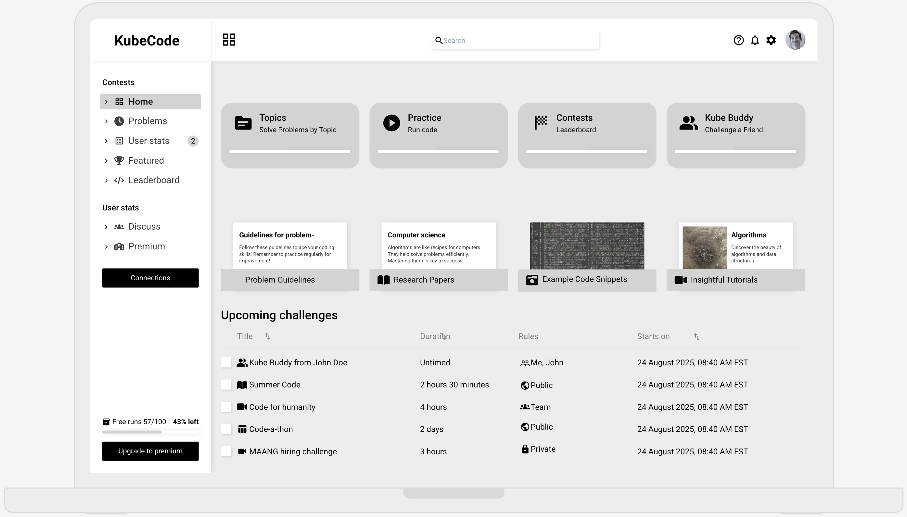

# 💻 Collaborative Coding Platform  
**_Learn better by coding together._**

A scalable, secure, and interactive platform for solving coding challenges—built in the spirit of LeetCode, but with a social and collaborative twist.

---

## 🖼️ Public View  
Here’s an example of the platform’s public interface:

---

## 🔧 Key Features

- 💡 **Challenge Friends**: Invite and compete with friends on custom or curated coding problems.
- ⚙️ **Real-Time Code Execution**: Instant feedback on submissions with live test case validation.
- 📦 **Isolated Runtime Environments**: Code runs securely inside Docker containers managed via Kubernetes.
- 📬 **Asynchronous Job Processing**: RabbitMQ powers scalable background job handling.
- ⚡ **Fast & Reliable Backend**: Redis and PostgreSQL for low-latency caching and job tracking.
- 🔌 **Modern API Stack**: - GraphQL for Frontend APIs and gRPC for internal microservice communication.
- 🖥️ **Next.js Frontend**: Intuitive and responsive user interface.
- 🌐 **Load Balancing**: Nginx efficiently manages traffic and scaling.

---

## 🔑 What Sets It Apart?
> Unlike traditional coding platforms, this app lets users **challenge friends with coding questions**, transforming coding practice into a **collaborative and competitive learning experience**.  
>  
> This social approach not only makes practice more **fun and engaging**, but also promotes **peer learning**, **active recall**, and **concept reinforcement**—essential tools for mastering programming.
